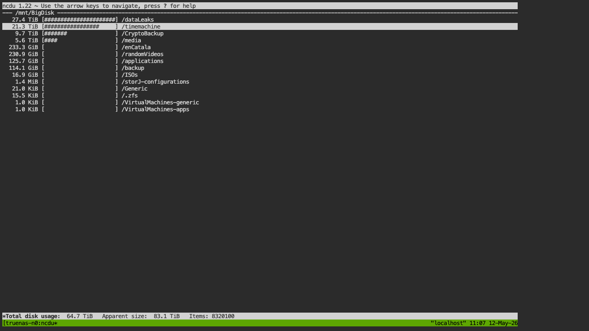
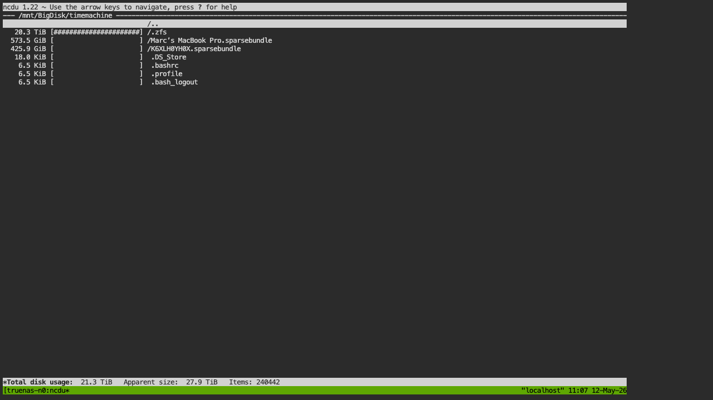
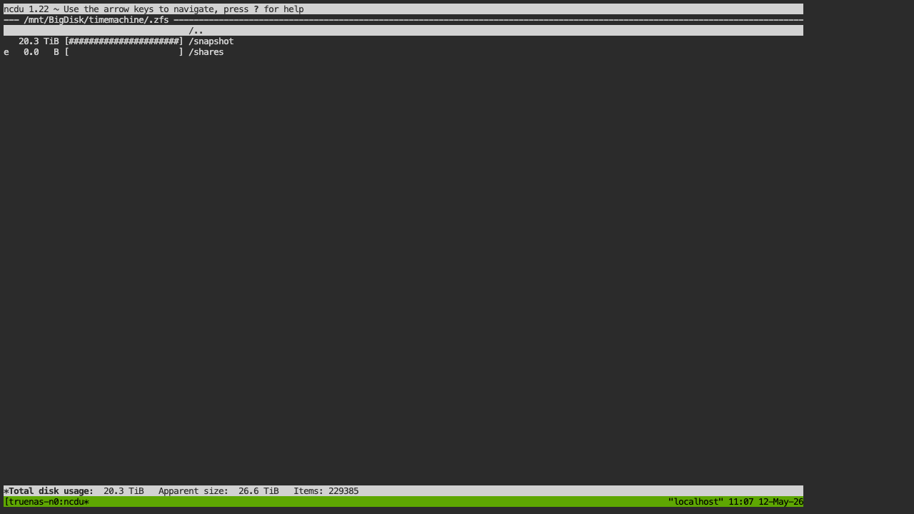
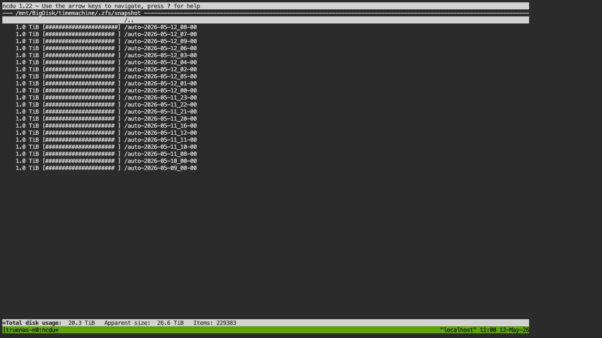
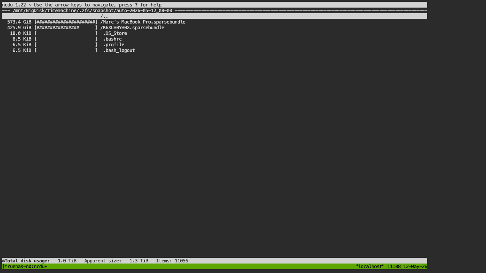
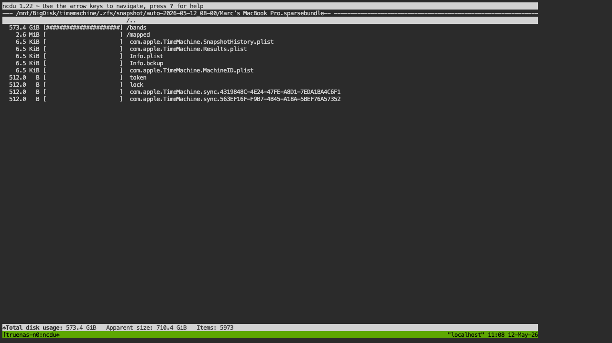

# Time Machine, ZFS Snapshots, and Large `ncdu` Totals

This note documents a real TrueNAS SCALE scan where `/mnt/BigDisk/timemachine` appeared as `21.3 TiB` in `ncdu`, even though the Mac being backed up has about `500 GiB` of data and is less than two months old.

## Finding

The `21.3 TiB` total is not the live Time Machine backup size. It is mostly `ncdu` walking the ZFS snapshot browser under `.zfs/snapshot` and adding each historical snapshot tree as if it were a normal directory.

From the captured scan:

- `/mnt/BigDisk/timemachine` reported `21.3 TiB`.
- `/mnt/BigDisk/timemachine/.zfs` reported `20.3 TiB`.
- `/mnt/BigDisk/timemachine/.zfs/snapshot` reported `20.3 TiB`.
- Each visible `auto-2026-05-12_*` snapshot was about `1.0 TiB`.
- The live backup data outside `.zfs` was about `999.4 GiB`, split across two sparsebundles:
  - `Marc's MacBook Pro.sparsebundle`: `573.5 GiB`
  - `K6XLH0YH0X.sparsebundle`: `425.9 GiB`

In plain terms: `ncdu` is accurately summing the directory tree it can see, but `.zfs/snapshot` makes each snapshot look like another complete directory tree. ZFS snapshots share blocks internally, so this is not the same as saying the pool has 20 TiB of unique Time Machine data.

## Captured Screens

Top-level `/mnt/BigDisk` view:



`/mnt/BigDisk/timemachine` shows `.zfs` dominating the total:



Inside `.zfs`:



Inside `.zfs/snapshot`, many snapshots each present around `1.0 TiB`:



One snapshot contains the same two sparsebundles:



Inside the live Time Machine sparsebundle, most data is in `bands`:



Current follow-up capture:


## Why It Happens

OpenZFS exposes filesystem snapshots under `.zfs/snapshot` when the snapshot directory is visible. TrueNAS also documents that dataset snapshots can be browsed through the hidden `.zfs` directory. That is useful for restores, but it confuses tree-walking size tools because every snapshot is presented as a browsable historical filesystem.

The pattern in this scan is:

```text
live sparsebundles:       about 1.0 TiB
visible snapshots:        about 20 snapshots x about 1.0 TiB each
ncdu displayed total:     about 21.3 TiB
```

That explains the order of magnitude. It does not mean the Mac wrote 21 TiB of unique backup data.

## Recommended Scan Settings

For normal TrueNAS storage inspection, exclude `.zfs`:

```bash
truenas-ncdu /mnt/BigDisk --exclude .zfs
```

In this image, version `0.2.2` and newer do that by default:

```text
NCDU_EXCLUDE_ZFS=true
```

Only disable it when you intentionally want to browse snapshot contents:

```text
NCDU_EXCLUDE_ZFS=false
```

If you also need to cross child datasets under a pool mount, use:

```text
NCDU_ONE_FILESYSTEM=false
NCDU_EXCLUDE_ZFS=true
```

## Check the True ZFS Space

Run these from the TrueNAS shell, adjusting the dataset name if your pool or dataset name differs:

```bash
zfs list -o name,used,usedbydataset,usedbysnapshots,refer,logicalused BigDisk/timemachine
zfs list -t snapshot -o name,used,refer -S creation -r BigDisk/timemachine | head -50
```

Use `usedbysnapshots` for the amount that would be freed if all snapshots of that dataset were removed. Do not add every snapshot's apparent directory size in `.zfs/snapshot`; shared blocks make that misleading.

## Why the Live Backup Is Still Near 1 TiB

The current live Time Machine area contains two sparsebundles, not one. That can happen when a Mac was renamed, migrated, re-added to Time Machine, or when an old bundle still exists. Time Machine also keeps versions, not only the current state of the laptop.

Before deleting anything, identify which sparsebundle your Mac is currently using from macOS Time Machine settings or with:

```bash
tmutil destinationinfo
```

Then treat the other bundle as a candidate for archival or deletion only after you confirm it is stale.

## References

- [OpenZFS `zfsconcepts(7)` snapshots](https://openzfs.github.io/openzfs-docs/man/v2.2/7/zfsconcepts.7.html)
- [OpenZFS `zfsprops(7)` space accounting](https://openzfs.github.io/openzfs-docs/man/master/7/zfsprops.7.html)
- [TrueNAS periodic snapshot tasks](https://www.truenas.com/docs/scale/24.10/scaletutorials/dataprotection/periodicsnapshottasksscale/)
- [TrueNAS creating snapshots](https://www.truenas.com/docs/core/13.3/coretutorials/storage/snapshots/)
- [Apple Time Machine backup frequency](https://support.apple.com/en-ie/HT201250)
